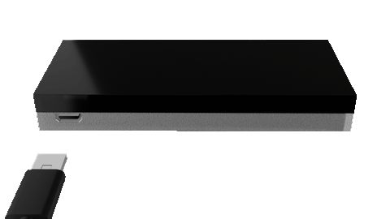

# KeepKey Template



## Overview

This is a starter template for building applications on top of the KeepKey hardware wallet. It provides a foundation for creating secure, user-friendly interfaces that interact with the KeepKey device.

## Features

- **Next.js Framework**: Built on [Next.js](https://nextjs.org) for modern web development
- **KeepKey Integration**: Ready-to-use components for interfacing with KeepKey hardware wallets
- **Pioneer SDK**: Leverages the Pioneer SDK for blockchain interaction
- **Chakra UI**: Sleek, responsive UI with Chakra UI components
- **Multi-Chain Support**: Easily work with multiple blockchains

## Getting Started

First, install the dependencies:

```bash
npm install
# or
yarn install
# or
pnpm install
```

Next, run the development server:

```bash
npm run dev
# or
yarn dev
# or
pnpm dev
```

Open [http://localhost:3000](http://localhost:3000) with your browser to see the application.

## Environment Setup

Create a `.env.local` file with the following variables:

```
NEXT_PUBLIC_PIONEER_URL=https://pioneer-api.pioneer.app
NEXT_PUBLIC_PIONEER_WSS=wss://pioneer-api.pioneer.app
```

## Customizing for Your Project

1. Modify `src/app/page.tsx` to adjust the landing page content
2. Update UI components in `src/components/` to match your branding
3. Extend blockchain functionality through the Pioneer SDK

## Learn More

- [KeepKey Documentation](https://docs.keepkey.com)
- [Pioneer SDK Reference](https://pioneer.app/docs)
- [Next.js Documentation](https://nextjs.org/docs)

## Contributing

Contributions are welcome! Please feel free to submit a Pull Request.

## License

MIT
